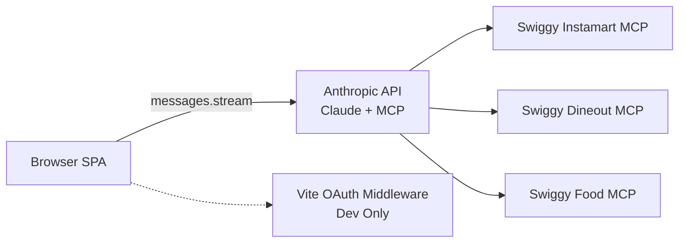

# Architecture

Canonical system architecture for the Swiggy MCP demo.

## System Overview
- Frontend: React SPA in `src/`.
- API integration: Anthropic SDK in browser mode (`src/lib/anthropic.ts`).
- Tool execution: Swiggy MCP tools executed server-side by Anthropic using `mcp_servers` + `mcp_toolset`.
- Dev OAuth: Vite middleware in `server/oauth` for local token acquisition.

## Runtime Topology

## Chat + MCP Lifecycle
1. User enters text in `ChatInput`.
2. `useChat.sendMessage` appends user message and chooses loading context.
3. `buildSessionStateSummary` derives compact state hints from recent user turns.
4. `buildMessageStreamParams` builds request payload:
   - bounded messages (`MAX_CONTEXT_MESSAGES = 8`)
   - prompt + optional address + datetime + optional summary blocks
   - MCP configuration (when Swiggy token exists)
   - context-management edit (`input_tokens: 12000`, keep `3` tool uses)
5. `runMessageStream` streams assistant blocks and monitors MCP tool errors.
6. Assistant blocks are sanitized (`sanitizeAssistantBlocks`) and persisted.
7. UI groups blocks and parses tool results into cards.
8. Dining restaurant payloads are strict-filtered/reranked before final card render.

## Data Flow Layers
1. Auth layer: `useAuth` + storage helpers.
2. Chat layer: `useChat`, `useChatApi`, `useChatPersistence`.
3. Integration layer: request builder, stream runner, retry policy, error classifiers.
4. Parser layer: orchestrator + specialized parsers.
5. Rendering layer: message bubbles, tool groups, typed cards.

## Prompt Runtime
- Vertical prompts are compiled from prompt profiles (`src/verticals/prompt-spec/profiles.ts` + compiler).
- Shared prompt rules appended by `src/verticals/shared-prompt.ts`.
- Optional session summary and datetime blocks are additional runtime context.
- Address lock block is included when selected address is known.
- Dining and foodorder summaries include compact filter memory for relevance continuity.

## Error Handling Model
### API-level errors
Handled by `classifyApiError`:
- 401: invalid API key
- 403: Swiggy session expired
- 429: rate limit with cooldown
- 529 / 5xx / network: transient errors

### MCP tool-level errors
Handled by `classifyMcpError` + stream abort guards:
- `auth`: abort immediately and trigger reconnect flow
- `address`: abort and trigger address reselection flow
- `server` / `validation`: bounded retries with abort guard

### Retry policy
- Retryable statuses include 429, 500, 502, 503, 504, 529.
- Stream timeout is `STREAM_REQUEST_TIMEOUT_MS = 90000`.
- Custom retry is used (`maxRetries: 0` on SDK client).

## State And Persistence
- Local storage keys include API key, Swiggy token/timestamp, selected address, and per-vertical chat histories.
- Chat history is sanitized before API usage and on persistence.
- Cart state is derived from parsed assistant tool results, not a separate server-backed cart store.

## OAuth Flow (Dev Only)
1. Browser opens `/api/auth/start`.
2. Middleware discovers endpoints, generates PKCE, stores pending state.
3. Browser returns to `/api/auth/callback` with auth code.
4. Middleware exchanges code for token and posts token to opener.
5. `useAuth` stores token in localStorage.

## Related Docs
- [Runtime Facts](./RUNTIME_FACTS.md)
- [Directory Map](./DIRECTORY_MAP.md)
- [Dependency Graph](./DEPENDENCY_GRAPH.md)
- [MCP Tools](./MCP_TOOLS.md)
- [Data Models](./DATA_MODELS.md)
