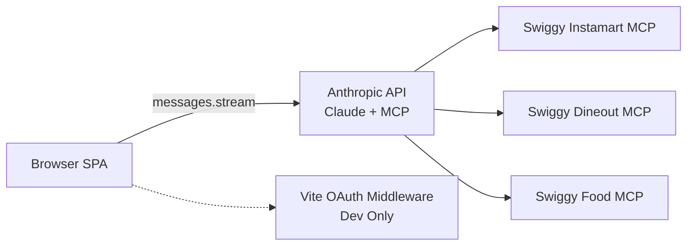

# Architecture

Canonical system architecture for the Swiggy MCP demo.

## System Overview
- Frontend: React SPA in `src/`.
- API integration: Anthropic SDK in browser mode (`src/lib/anthropic.ts`).
- Tool execution: Swiggy MCP tools executed server-side by Anthropic using `mcp_servers` + `mcp_toolset`.
- Dev OAuth: Vite middleware in `server/oauth` for local token acquisition.

## Runtime Topology

## Chat + MCP Lifecycle
1. User enters text in `ChatInput`.
2. `useChat.sendMessage` appends a user-visible message and chooses loading context via shared runtime intent signals.
3. `useChat.sendMessage` can send an API-only enriched text (`apiText`) for model/tool reliability while preserving clean user-visible bubbles.
4. `buildSessionStateSummary` derives compact state hints from recent user turns.
5. `buildMessageStreamParams` builds request payload:
   - bounded messages (`MAX_CONTEXT_MESSAGES = 8`)
   - older long user turns compacted before bounding (`MAX_OLD_USER_MESSAGE_CHARS = 240`)
   - prompt + optional address + datetime + optional summary blocks
   - MCP configuration (when Swiggy token exists)
   - context-management edit (`input_tokens: 12000`, keep `3` tool uses)
6. `runMessageStream` streams assistant blocks and monitors MCP tool errors.
7. Assistant blocks are sanitized (`sanitizeAssistantBlocks`) and persisted.
8. UI groups blocks and parses tool results into cards.
9. Parser orchestration applies staged routing (tool-patterns -> shape fallback -> status/info fallback) with relevance post-processing when render context is available.
10. Dining and foodorder strict-first reranking preserves constraints while returning best candidates; dining surfaces closest options when exact combined matches are unavailable, and slot rails prioritize requested-time matches first.

## Data Flow Layers
1. Auth layer: `useAuth` + storage helpers.
2. Chat layer: `useChat`, `useChatApi`, `useChatPersistence`, `useLoadingLabel`.
3. Integration layer: request builder, stream runner, retry policy, table-driven error classifier.
4. Intent layer: shared runtime signal detection in `src/lib/intent/runtime-signals.ts`.
5. Parser layer: orchestrator + routing signals + relevance post-processing + specialized parsers.
6. Relevance layer: shared utilities (`relevance/shared.ts`), unified patterns (`relevance/patterns.ts`), vertical-specific rerankers (`relevance/dining.ts`, `relevance/foodorder.ts`, `relevance/generic.ts`).
7. Cart layer: `useCart` + `src/lib/cart/latest-cart.ts` + optimistic cart key/matching helpers.
8. Rendering layer: message bubbles, tool groups, typed cards.

## Prompt Runtime
- Vertical prompts are compiled from prompt profiles (`src/verticals/prompt-spec/profiles.ts` + compiler).
- Shared prompt rules appended by `src/verticals/shared-prompt.ts`.
- Optional session summary and datetime blocks are additional runtime context.
- Address lock block is included when selected address is known.
- Dining and foodorder summaries include compact filter memory for relevance continuity.
- Session summaries can also include compact selection-memory hints (`last_cart_selection`, `last_restaurant_selection`, `last_slot_selection`) derived from recent structured action payloads.
- Nutrition and Styling advisory turns are prompt-constrained to remain tool-silent unless the user explicitly asks to source/find/buy items.

## Error Handling Model
### API-level errors
Handled by `classifyApiError` (table-driven `ERROR_RULES` array):
- 401: invalid API key
- 403: Swiggy session expired
- 429: rate limit with cooldown
- 529 / 5xx / network: transient errors

### MCP tool-level errors
Handled by `classifyMcpError` + stream abort guards:
- `auth`: abort immediately and trigger reconnect flow
- `address`: abort and trigger address reselection flow
- `server` / `validation`: bounded retries with abort guard

### Retry policy
- Retryable statuses include 429, 500, 502, 503, 504, 529.
- Retry budgets centralized in `src/lib/constants.ts`:
  - `RATE_LIMIT_MAX_RETRIES = 1`
  - `HEAVY_CONTEXT_RETRY_LIMIT = 1`
  - `CHAT_REQUEST_MAX_RETRIES = 2`
- Stream timeout is `STREAM_REQUEST_TIMEOUT_MS = 90000`.
- Custom retry is used (`maxRetries: 0` on SDK client).

## State And Persistence
- Local storage keys include API key, Swiggy token/timestamp, selected address, and per-vertical chat histories.
- Chat history is sanitized before API usage and on persistence.
- User bubbles intentionally render the clean user message text; internal transport metadata is not shown in chat UI.
- Cart state is derived from parsed assistant tool results, not a separate server-backed cart store.
- For `food`, `style`, and `foodorder`, cart derivation reconciles partial add-mutation snapshots against prior cart state to avoid dropping earlier items when tools return delta-like payloads.
- Foodorder optimistic cart state uses stable keys (vertical + restaurant scope + item id/name) to reduce cross-restaurant item collisions before authoritative cart results arrive.
- UI actions are emitted with stable human-readable messages plus structured identity metadata (IDs/variants/slot refs) to reduce cross-turn disambiguation failures.
- Action transport can include model-facing metadata in API-only text while preserving stable visible message templates.
- Navigation adds a Nutrition/Style (`food` <-> `style`) switch guard: when source-tab state exists, confirmation is required before switch, source-tab chat is cleared, and a best-effort background Instamart cart-clear request is attempted.

## OAuth Flow (Dev Only)
1. Browser opens `/api/auth/start`.
2. Middleware discovers endpoints, generates PKCE, stores pending state.
3. Browser returns to `/api/auth/callback` with auth code.
4. Middleware exchanges code for token and posts token to opener.
5. `useAuth` stores token in localStorage.

## Related Docs
- [Runtime Facts](./RUNTIME_FACTS.md)
- [Directory Map](./DIRECTORY_MAP.md)
- [Dependency Graph](./DEPENDENCY_GRAPH.md)
- [MCP Tools](./MCP_TOOLS.md)
- [Data Models](./DATA_MODELS.md)
