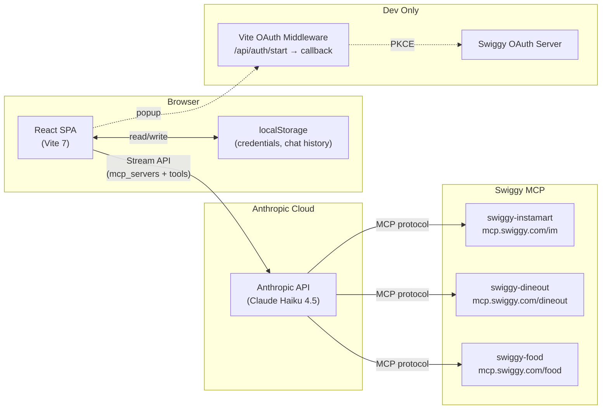
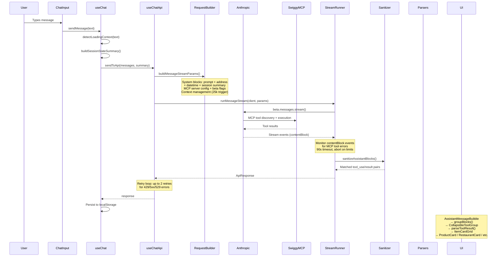
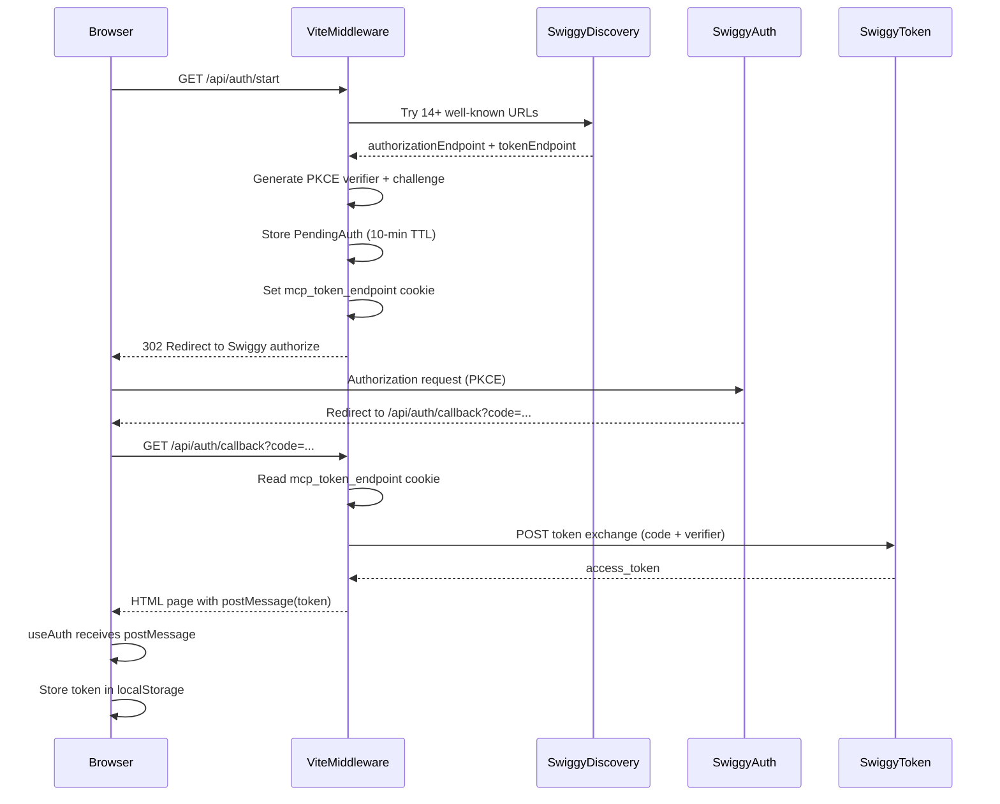

# Architecture

High-level system design for the Swiggy MCP Demo — a browser-only React SPA that uses the Anthropic SDK to orchestrate AI-driven commerce experiences through Swiggy's MCP servers.

See also: [architecture/system-map.md](./architecture/system-map.md), [architecture/runtime-sequences.md](./architecture/runtime-sequences.md)

---

## System Overview

The app is a **browser-only SPA** — there is no backend server in production. The Anthropic SDK runs directly in the browser (`dangerouslyAllowBrowser: true`). MCP tool calls are proxied through Anthropic's servers, which connect to Swiggy's MCP endpoints, discover tools at runtime, execute them, and return results — all in a single API round trip.



---

## Tech Stack

### Production Dependencies

| Package | Version | Purpose |
|---------|---------|---------|
| `@anthropic-ai/sdk` | ^0.74.0 | Anthropic API client with MCP beta support |
| `react` | ^19.2.0 | UI framework |
| `react-dom` | ^19.2.0 | React DOM renderer |
| `react-router-dom` | ^7.13.0 | Client-side routing |
| `tailwindcss` | ^4.1.18 | CSS-first utility framework |
| `@tailwindcss/vite` | ^4.1.18 | Tailwind Vite plugin |
| `radix-ui` | ^1.4.3 | Headless UI primitives (via shadcn/ui) |
| `class-variance-authority` | ^0.7.1 | Component variant API |
| `clsx` | ^2.1.1 | Conditional class names |
| `tailwind-merge` | ^3.4.0 | Tailwind class conflict resolution |
| `lucide-react` | ^0.563.0 | Icon library |
| `@fontsource/geist-sans` | ^5.2.5 | Sans-serif font |
| `@fontsource/geist-mono` | ^5.2.7 | Monospace font |
| `zod` | ^4.3.6 | Runtime schema validation (imported as `zod/v4`) |

### Dev Dependencies

| Package | Version | Purpose |
|---------|---------|---------|
| `vite` | ^7.2.4 | Build tool and dev server |
| `@vitejs/plugin-react` | ^5.1.1 | React Fast Refresh |
| `typescript` | ~5.9.3 | Type checking |
| `vitest` | ^4.0.18 | Test runner |
| `jsdom` | ^28.0.0 | DOM environment for tests |
| `@testing-library/react` | ^16.3.2 | React testing utilities |
| `@testing-library/dom` | ^10.4.1 | DOM testing utilities |
| `@testing-library/jest-dom` | ^6.9.1 | Custom DOM matchers |
| `@testing-library/user-event` | ^14.6.1 | User interaction simulation |
| `eslint` | ^9.39.1 | Linter |
| `@eslint/js` | ^9.39.1 | ESLint JS config |
| `eslint-plugin-react-hooks` | ^7.0.1 | React hooks linting |
| `eslint-plugin-react-refresh` | ^0.4.24 | React refresh linting |
| `typescript-eslint` | ^8.46.4 | TypeScript ESLint rules |
| `globals` | ^16.5.0 | Global variable definitions |
| `@types/node` | ^24.10.1 | Node.js type definitions |
| `@types/react` | ^19.2.5 | React type definitions |
| `@types/react-dom` | ^19.2.3 | React DOM type definitions |

---

## Runtime Topology

The app operates entirely in the browser. There is no Node.js backend in production.

- **`dangerouslyAllowBrowser: true`**: The Anthropic SDK is initialized in the browser. This is intentional — MCP tool calls are executed server-side by Anthropic, not in the browser.
- **Anthropic as MCP proxy**: When the SDK sends a request with `mcp_servers` and `tools: [{ type: "mcp_toolset" }]`, Anthropic's servers connect to the specified MCP server, discover available tools, let Claude choose which to call, execute them, and return results.
- **OAuth dev-only**: The PKCE OAuth flow for obtaining Swiggy tokens runs as a Vite dev middleware plugin. In production, tokens must be obtained externally.

---

## Request Lifecycle



---

## Data Flow Layers

```
┌─────────────────────────────────────────────────────────┐
│  Auth Layer (useAuth)                                   │
│  API key + Swiggy token + onboarding step machine       │
├─────────────────────────────────────────────────────────┤
│  Chat Orchestration (useChat)                           │
│  Composes useChatApi + useChatPersistence               │
│  Loading context labels, session state summary          │
├─────────────────────────────────────────────────────────┤
│  Integration Layer (integrations/anthropic/)            │
│  Request builder → Stream runner → Sanitizer            │
│  Error classifier, MCP tool errors, retry policy        │
├─────────────────────────────────────────────────────────┤
│  Parser Layer (lib/parsers/)                            │
│  Orchestrator → 13 specialized parsers                  │
│  unwrap → extractPayload → tool name regex → parser     │
├─────────────────────────────────────────────────────────┤
│  UI Layer (components/)                                 │
│  AssistantMessageBubble → groupBlocks → cards           │
│  ChatView → MessageList → CollapsibleToolGroup          │
└─────────────────────────────────────────────────────────┘
```

---

## Prompt Architecture

System prompts are built from structured `PromptProfile` objects:

1. **PromptProfile** → `compilePromptProfile()` → structured prompt sections (Mission, Scope, Slots, Phases, Policies, Style, Confirmation, Fallbacks)
2. **Shared rules** appended: Search Efficiency, Card-First Rendering, Tool Error Handling, Location Lock
3. **Optional COD rule** for verticals with `includeCodRule: true`
4. **`buildSystemPrompt()`** in `shared-prompt.ts` assembles the final prompt

At API call time, `buildMessageStreamParams()` creates 3-4 system blocks:

| Block | `cache_control` | Purpose |
|-------|-----------------|---------|
| System prompt | `{ type: "ephemeral" }` | Full vertical prompt (cached, 5-min TTL) |
| Address context | `{ type: "ephemeral" }` | Active delivery address (cached, only if address present) |
| Date/time context | _(none)_ | Current date/time for time-sensitive decisions |
| Session summary | _(none)_ | Compact state string: `slots=...; intent=...; confirm=...; datetime=...; restaurant=...; location=...` |

Session summary is deliberately **not cached** because it changes every turn.

---

## Token Strategy

- **Prompt caching**: `cache_control: { type: "ephemeral" }` on system prompt and address blocks. 5-minute TTL. Reduces input token costs on consecutive turns.
- **Cache hierarchy**: tools → system → messages (prefix-based matching)
- **Context management**: `clear_tool_uses_20250919` edit rule. Triggered when input exceeds 25,000 tokens. Keeps last 5 tool uses, clears at least 2,000 tokens to avoid cache invalidation for small clearings.
- **Message cap**: `MAX_CONTEXT_MESSAGES = 24` — only the last 24 messages are sent to the API.
- **Beta flags**: `mcp-client-2025-11-20`, `prompt-caching-2024-07-31`, `context-management-2025-06-27`
- **SDK retries disabled**: `maxRetries: 0` — custom retry policy handles retries instead.

---

## Error Handling Architecture

Two independent error handling layers plus a retry policy:

### Layer 1: API-Level Errors (`error-classifier.ts`)

HTTP status codes from the Anthropic API:

| Status | Classification | Message |
|--------|---------------|---------|
| 401 | Auth | Invalid API key |
| 403 | Auth | Swiggy session expired |
| 429 | Rate limit | Rate limit exceeded |
| 500 | Server | Server error |
| 529 | Overload | Service overloaded |
| Network | Network | Check connection |

### Layer 2: MCP Tool-Level Errors (`mcp-tool-errors.ts` + `stream-runner.ts`)

Errors from MCP tool execution, monitored via `contentBlock` stream events:

| Category | Patterns | Action |
|----------|----------|--------|
| `auth` | 401, 403, forbidden, expired, unauthorized | Abort immediately (limit: 1), call `onAuthError` |
| `address` | "address with id", "address not found", "invalid address" | Abort immediately, call `onAddressError` |
| `server` | 500, 502, 503, 504, 529, overload, timeout | Abort after 2 errors |
| `validation` | Everything else | Abort after 2 errors |

### Retry Policy (`retry-policy.ts`)

- **Retryable statuses**: 429, 500, 502, 503, 504, 529
- **Max retries**: 2 (separate `RATE_LIMIT_MAX_RETRIES=2` budget for 429 errors with header logging)
- **Backoff**: exponential — 500ms base, 2x multiplier, 20% jitter, 5s cap
- **Rate limit headers**: `extractRateLimitHeaders()` logs `anthropic-ratelimit-*` headers on 429 errors
- **Stream timeout**: 90s (`STREAM_REQUEST_TIMEOUT_MS`) — stream aborts and returns partial content

---

## OAuth Flow (Dev Only)



---

## State Management Philosophy

**Hooks-only** — no Redux, Zustand, or React Context providers.

| Hook | State | Persistence |
|------|-------|-------------|
| `useAuth` | API key, Swiggy token, onboarding step, selected address, token staleness | localStorage |
| `useChat` | Messages, loading state, loading labels, error, token usage | localStorage (via `useChatPersistence`) |
| `useChatApi` | Anthropic client (memoized) | Memory only |
| `useChatPersistence` | Messages array | localStorage per vertical |
| `useCart` | Derived cart state | Computed from messages |

All state lives in individual hooks. Components receive state via props from `App.tsx`. The `ChatViewInner` component uses `key={verticalId}` to fully remount with fresh hook state when the vertical changes.

---

## Cross-References

- [DIRECTORY_MAP.md](./DIRECTORY_MAP.md) — File-by-file reference
- [MCP_TOOLS.md](./MCP_TOOLS.md) — MCP tool documentation
- [DATA_MODELS.md](./DATA_MODELS.md) — TypeScript interfaces and schemas
- [QUIRKS_AND_PATTERNS.md](./QUIRKS_AND_PATTERNS.md) — Tribal knowledge
- [architecture/system-map.md](./architecture/system-map.md) — Existing system map
- [architecture/runtime-sequences.md](./architecture/runtime-sequences.md) — Existing sequence diagrams
