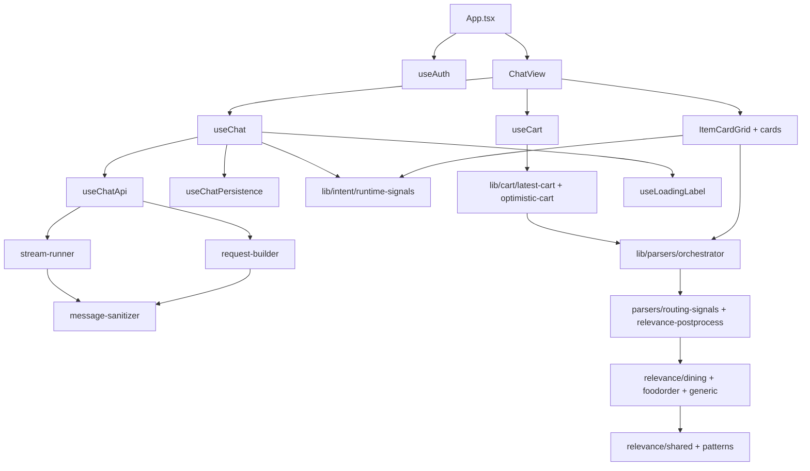

# Dependency Graph

Module dependency map based on current source composition.

## High-Level Graph

## Hook Composition
1. `useChat` composes `useChatApi` + `useChatPersistence`.
2. `useChatApi` composes client factory, request builder, stream runner, and retry/error helpers (with adaptive retry budget).
3. `useCart` delegates authoritative snapshot extraction to `src/lib/cart/latest-cart.ts`.
4. `ChatView` foodorder optimistic cart uses stable cart-key helpers from `src/lib/cart/optimistic-cart.ts`.

## Parser Graph
- Entrypoint: `parseToolResult` (`orchestrator.ts`).
- Shared pre-processing: `unwrapContent` + `extractPayload`.
- Routing signals: `routing-signals.ts` (tool-patterns + payload-shape signals).
- Relevance post-processing: `relevance-postprocess.ts` routes to vertical-specific rerankers.
- Relevance foundation: `relevance/shared.ts` (utilities), `relevance/patterns.ts` (unified pattern registries).
- Vertical rerankers: `relevance/dining.ts`, `relevance/foodorder.ts`, `relevance/generic.ts`.
- Specialized parsers: products, restaurants, cart, time slots, addresses, confirmation, status, info.
- Fallback chain: shape-detect -> status -> info -> raw.

## Rendering Graph
1. `AssistantMessageBubble` groups blocks by tool/text boundaries.
2. `CollapsibleToolGroup` resolves parsed tool results.
3. `ItemCardGrid` dispatches to typed card components.
4. Card interactions emit deterministic `ChatAction` messages back into `sendMessage`.

## External Runtime Dependencies
- Anthropic SDK for streaming and MCP tool execution.
- React + React Router for app shell.
- Tailwind + Radix/shadcn primitives for UI.
- Vitest + Testing Library for tests.

## Related Docs
- [Architecture](./ARCHITECTURE.md)
- [Directory Map](./DIRECTORY_MAP.md)
- [MCP Tools](./MCP_TOOLS.md)
