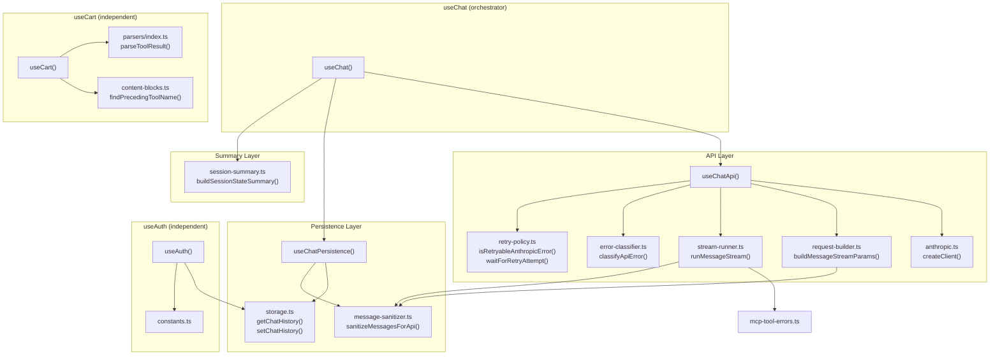
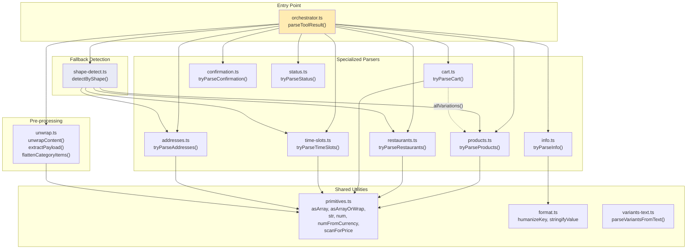

# Dependency Graph

Module relationships, hook composition, parser internals, and third-party dependency documentation.

See also: [ARCHITECTURE.md](./ARCHITECTURE.md), [DIRECTORY_MAP.md](./DIRECTORY_MAP.md)

---

## High-Level Module Dependencies

```mermaid
graph TD
    App["App.tsx"]
    App --> useAuth["useAuth"]
    App --> Header["Header"]
    App --> PhoneFrame["PhoneFrame"]
    App --> OnboardingSheet["OnboardingSheet"]
    App --> SettingsMenu["SettingsMenu"]
    App --> LandingPage["LandingPage"]
    App --> ChatView["ChatView"]
    App --> ErrorBoundary["ErrorBoundary"]

    ChatView --> useChat["useChat"]
    ChatView --> useCart["useCart"]
    ChatView --> MessageList["MessageList"]
    ChatView --> ChatInput["ChatInput"]
    ChatView --> CartFloatingButton["CartFloatingButton"]
    ChatView --> CartPanel["CartPanel"]

    useAuth --> storage["storage.ts"]
    useAuth --> constants["constants.ts"]

    useChat --> useChatApi["useChatApi"]
    useChat --> useChatPersistence["useChatPersistence"]
    useChat --> sessionSummary["session-summary.ts"]

    useChatApi --> anthropicClient["anthropic.ts"]
    useChatApi --> requestBuilder["request-builder.ts"]
    useChatApi --> streamRunner["stream-runner.ts"]
    useChatApi --> errorClassifier["error-classifier.ts"]
    useChatApi --> retryPolicy["retry-policy.ts"]

    useChatPersistence --> storage
    useChatPersistence --> messageSanitizer["message-sanitizer.ts"]

    useCart --> parsers["parsers/"]
    useCart --> contentBlocks["content-blocks.ts"]

    streamRunner --> mcpToolErrors["mcp-tool-errors.ts"]
    streamRunner --> messageSanitizer

    requestBuilder --> messageSanitizer
    requestBuilder --> constants

    parsers --> types["types.ts"]
    parsers --> constants
    parsers --> logger["logger.ts"]

    MessageList --> AssistantBubble["AssistantMessageBubble"]
    AssistantBubble --> contentBlocks
    AssistantBubble --> CollapsibleToolGroup["CollapsibleToolGroup"]
    CollapsibleToolGroup --> parsers
    CollapsibleToolGroup --> ItemCardGrid["ItemCardGrid"]
    ItemCardGrid --> ProductCard["ProductCard"]
    ItemCardGrid --> RestaurantCard["RestaurantCard"]
    ItemCardGrid --> CartSummaryCard["CartSummaryCard"]
    ItemCardGrid --> TimeSlotPicker["TimeSlotPicker"]
    ItemCardGrid --> AddressPicker["AddressPicker"]
    ItemCardGrid --> StatusCard["StatusCard"]
    ItemCardGrid --> InfoCard["InfoCard"]
    ItemCardGrid --> BookingConfirmedCard["BookingConfirmedCard"]
    ItemCardGrid --> OrderConfirmationCard["OrderConfirmationCard"]

    style useAuth fill:#e1f5fe
    style useChat fill:#e1f5fe
    style useChatApi fill:#e1f5fe
    style useChatPersistence fill:#e1f5fe
    style useCart fill:#e1f5fe
    style parsers fill:#fff3e0
    style requestBuilder fill:#f3e5f5
    style streamRunner fill:#f3e5f5
    style messageSanitizer fill:#f3e5f5
    style errorClassifier fill:#f3e5f5
    style retryPolicy fill:#f3e5f5
    style mcpToolErrors fill:#f3e5f5
    style sessionSummary fill:#f3e5f5
```



---

## Hook Composition Chain



---

## Parser Internal Graph



---

## Component Composition (ChatView Tree)

```
App
├── PhoneFrame
│   ├── OnboardingSheet
│   │   ├── ApiKeyModal
│   │   ├── SwiggyConnect
│   │   └── AddressPicker
│   ├── Header
│   │   └── SettingsMenu
│   ├── ErrorBoundary
│   │   └── Routes
│   │       ├── LandingPage
│   │       │   └── VerticalCard (×4)
│   │       └── ChatView
│   │           └── ChatViewInner (key={verticalId})
│   │               ├── MessageList
│   │               │   ├── UserMessageBubble (×n)
│   │               │   ├── AssistantMessageBubble (×n)
│   │               │   │   ├── CollapsibleToolGroup (×n)
│   │               │   │   │   ├── ToolTrace
│   │               │   │   │   └── ItemCardGrid
│   │               │   │   │       ├── ProductGrid → ProductCard
│   │               │   │   │       ├── RestaurantCard
│   │               │   │   │       ├── CartSummaryCard
│   │               │   │   │       ├── TimeSlotPicker
│   │               │   │   │       ├── AddressPicker
│   │               │   │   │       ├── StatusCard
│   │               │   │   │       ├── InfoCard
│   │               │   │   │       ├── BookingConfirmedCard
│   │               │   │   │       ├── OrderConfirmationCard
│   │               │   │   │       └── BookingConfirmationSheet
│   │               │   │   └── CollapsibleText
│   │               │   └── LoadingIndicator
│   │               ├── CartFloatingButton
│   │               ├── Sheet → CartPanel
│   │               │   └── OrderConfirmation
│   │               └── ChatInput
│   └── VerticalNav
```

---

## Third-Party Dependencies

### Production (14 packages)

| Package | Version | Purpose | Primary Consumers |
|---------|---------|---------|-------------------|
| `@anthropic-ai/sdk` | ^0.74.0 | Anthropic API client with MCP beta | `anthropic.ts`, `fetchAddresses.ts`, `stream-runner.ts` |
| `react` | ^19.2.0 | UI framework | All components |
| `react-dom` | ^19.2.0 | React DOM renderer | `main.tsx` |
| `react-router-dom` | ^7.13.0 | Client-side routing (BrowserRouter) | `App.tsx`, `ChatView.tsx` |
| `tailwindcss` | ^4.1.18 | CSS utility framework | All components (via classes) |
| `@tailwindcss/vite` | ^4.1.18 | Tailwind Vite integration | `vite.config.ts` |
| `radix-ui` | ^1.4.3 | Headless UI primitives | `ui/` components (dialog, sheet, dropdown, etc.) |
| `class-variance-authority` | ^0.7.1 | Component variant API (CVA) | `ui/button.tsx`, `ui/badge.tsx` |
| `clsx` | ^2.1.1 | Conditional class name strings | `utils.ts` → `cn()` |
| `tailwind-merge` | ^3.4.0 | Tailwind class conflict resolution | `utils.ts` → `cn()` |
| `lucide-react` | ^0.563.0 | SVG icon components | Various components (Salad, Sparkles, Bike, etc.) |
| `@fontsource/geist-sans` | ^5.2.5 | Geist sans-serif font | `main.tsx` import |
| `@fontsource/geist-mono` | ^5.2.7 | Geist monospace font | `main.tsx` import |
| `zod` | ^4.3.6 | Runtime schema validation | `schemas.ts` (imported as `zod/v4`) |

### Dev (15 packages)

| Package | Version | Purpose | Used In |
|---------|---------|---------|---------|
| `vite` | ^7.2.4 | Build tool and dev server | Build pipeline |
| `@vitejs/plugin-react` | ^5.1.1 | React Fast Refresh for Vite | `vite.config.ts` |
| `typescript` | ~5.9.3 | Type checking and compilation | Build pipeline |
| `vitest` | ^4.0.18 | Test runner (Vite-native) | Test pipeline |
| `jsdom` | ^28.0.0 | DOM environment for tests | `vitest.config.ts` |
| `@testing-library/react` | ^16.3.2 | React component testing | Test files |
| `@testing-library/dom` | ^10.4.1 | DOM testing utilities | Test files |
| `@testing-library/jest-dom` | ^6.9.1 | Custom DOM assertion matchers | `test/setup.ts` |
| `@testing-library/user-event` | ^14.6.1 | User interaction simulation | Test files |
| `eslint` | ^9.39.1 | JavaScript/TypeScript linter | Lint pipeline |
| `@eslint/js` | ^9.39.1 | ESLint JS recommended config | `eslint.config.js` |
| `eslint-plugin-react-hooks` | ^7.0.1 | React hooks rules | `eslint.config.js` |
| `eslint-plugin-react-refresh` | ^0.4.24 | React refresh rules | `eslint.config.js` |
| `typescript-eslint` | ^8.46.4 | TypeScript ESLint rules | `eslint.config.js` |
| `globals` | ^16.5.0 | Global variable type definitions | `eslint.config.js` |

Type definition packages: `@types/node` (^24.10.1), `@types/react` (^19.2.5), `@types/react-dom` (^19.2.3)

---

## Cross-References

- [ARCHITECTURE.md](./ARCHITECTURE.md) — System design and data flow layers
- [DIRECTORY_MAP.md](./DIRECTORY_MAP.md) — Complete file listing
