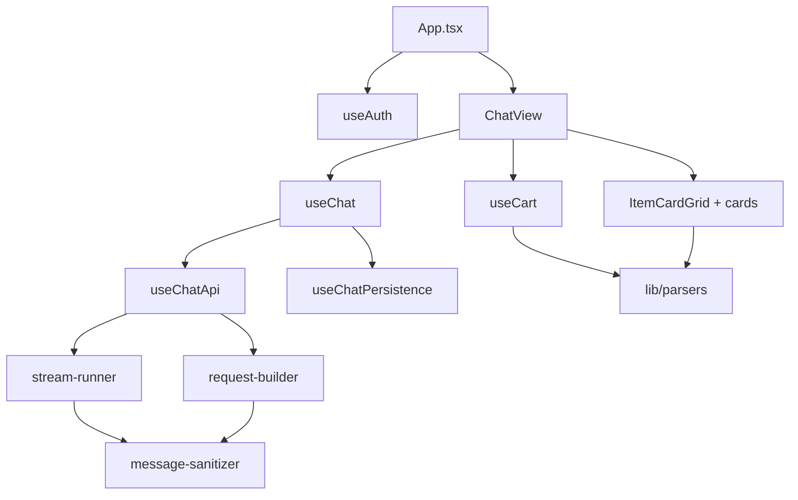

# Dependency Graph

Module dependency map based on current source composition.

## High-Level Graph

## Hook Composition
1. `useChat` composes `useChatApi` + `useChatPersistence`.
2. `useChatApi` composes client factory, request builder, stream runner, and retry/error helpers.
3. `useCart` reads assistant blocks and re-parses tool results to extract latest cart state.

## Parser Graph
- Entrypoint: `parseToolResult` (`orchestrator.ts`).
- Shared pre-processing: `unwrapContent` + `extractPayload`.
- Specialized parsers: products, restaurants, cart, time slots, addresses, confirmation, status, info.
- Fallback chain: shape-detect -> status -> info -> raw.

## Rendering Graph
1. `AssistantMessageBubble` groups blocks by tool/text boundaries.
2. `CollapsibleToolGroup` resolves parsed tool results.
3. `ItemCardGrid` dispatches to typed card components.
4. Card interactions emit deterministic `ChatAction` messages back into `sendMessage`.

## External Runtime Dependencies
- Anthropic SDK for streaming and MCP tool execution.
- React + React Router for app shell.
- Tailwind + Radix/shadcn primitives for UI.
- Vitest + Testing Library for tests.

## Related Docs
- [Architecture](./ARCHITECTURE.md)
- [Directory Map](./DIRECTORY_MAP.md)
- [MCP Tools](./MCP_TOOLS.md)
