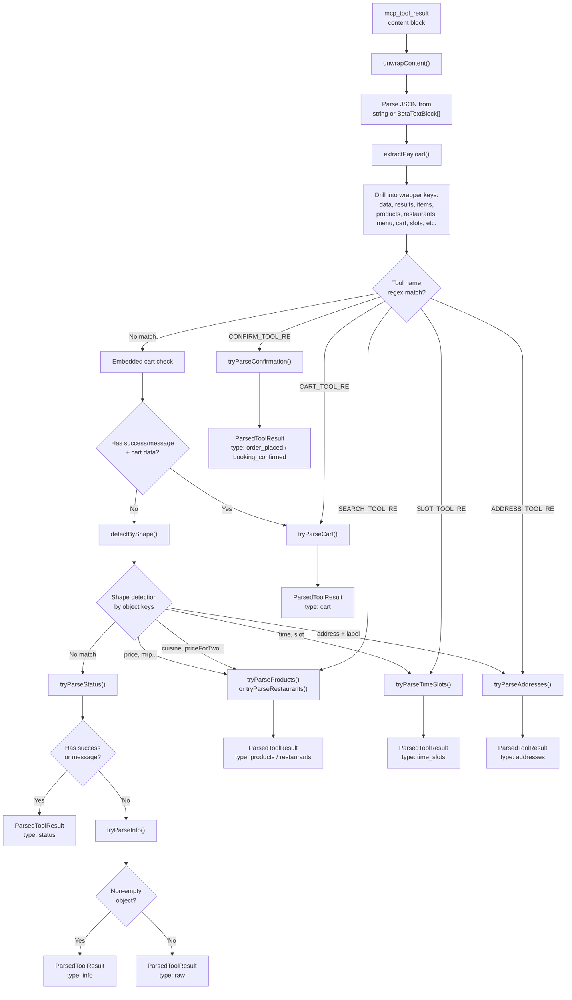

# MCP Tools

Documentation of MCP (Model Context Protocol) tools as used in this project. See also: [contracts/parser-contract.md](./contracts/parser-contract.md), [ARCHITECTURE.md](./ARCHITECTURE.md).

---

## Critical Caveat: Runtime-Discovered Tools

**Tools are NOT defined locally.** The Anthropic API connects to Swiggy's MCP servers at runtime, discovers all available tools dynamically, and lets Claude decide which to call. The tool names, parameters, and response shapes documented below are **inferred from parser code and regex patterns** — they represent what the codebase expects, not a definitive API contract.

The API configuration sends:
```json
{
  "tools": [{ "type": "mcp_toolset", "mcp_server_name": "swiggy-instamart" }]
}
```

This tells Anthropic: "discover and expose all tools from this MCP server." The actual tool catalog is controlled by Swiggy.

---

## How MCP Works in This Project

1. **SDK sends `mcp_servers` array** with the MCP server URL, name, and Swiggy auth token
2. **Anthropic's servers** connect to the MCP endpoint, discover available tools, and present them to Claude
3. **Claude selects tools** based on the system prompt and user message
4. **Anthropic executes the tool calls** against the MCP server (server-side, not in the browser)
5. **Results stream back** as `mcp_tool_use` and `mcp_tool_result` content blocks
6. **Client-side parsers** extract structured data from tool results for rich card rendering

Required beta flag: `mcp-client-2025-11-20`

---

## MCP Server Configuration

| Server | Key | URL | Name | Used By |
|--------|-----|-----|------|---------|
| Instamart | `instamart` | `https://mcp.swiggy.com/im` | `swiggy-instamart` | NutriCart (`food`), StyleKit (`style`) |
| Dineout | `dineout` | `https://mcp.swiggy.com/dineout` | `swiggy-dineout` | TableScout (`dining`) |
| Food | `food` | `https://mcp.swiggy.com/food` | `swiggy-food` | FeedMe (`foodorder`) |

Defined in `src/lib/constants.ts` (`MCP_SERVERS`).

---

## API Configuration Details

From `request-builder.ts`, the full API params structure:

```typescript
{
  model: "claude-haiku-4-5-20251001",
  max_tokens: 800,
  system: [
    { type: "text", text: systemPrompt, cache_control: { type: "ephemeral" } },
    { type: "text", text: addressContext, cache_control: { type: "ephemeral" } },  // if address present
    { type: "text", text: datetimeContext },
    { type: "text", text: sessionSummary },                                        // if present
  ],
  messages: [...],  // last 24 messages, sanitized
  betas: ["mcp-client-2025-11-20", "prompt-caching-2024-07-31", "context-management-2025-06-27"],
  context_management: {
    edits: [{
      type: "clear_tool_uses_20250919",
      trigger: { type: "input_tokens", value: 25000 },
      keep: { type: "tool_uses", value: 5 },
      clear_at_least: { type: "input_tokens", value: 2000 },
    }]
  },
  mcp_servers: [{
    type: "url",
    url: "https://mcp.swiggy.com/im",
    name: "swiggy-instamart",
    authorization_token: "<swiggy-token>"
  }],
  tools: [{
    type: "mcp_toolset",
    mcp_server_name: "swiggy-instamart"
  }]
}
```

---

## Inferred Tool Categories

The orchestrator (`src/lib/parsers/orchestrator.ts`) routes tool results using regex patterns on tool names. These patterns reveal the expected tool naming conventions.

### 1. Search / Discovery Tools

**Regex:** `SEARCH_TOOL_RE = /search|find|discover|browse|menu|list|recommend|suggest|get_.*(?:product|restaurant|item|dish|cuisine)/i`

**Inferred tool names:** `search_products`, `find_restaurants`, `discover_items`, `browse_menu`, `list_restaurants`, `recommend_dishes`, `suggest_items`, `get_products`, `get_restaurant_menu`, `get_dish_items`

**Server context:** All 3 MCP servers likely expose search tools

**Parser routing:**
- For `foodorder` vertical: complex disambiguation logic (see below)
- For `dining` vertical: tries restaurants first
- Default: tries products first

**Response field patterns** (from `products.ts`): `name`, `displayName`, `product_name`, `title`, `price`, `selling_price`, `mrp`, `variations`, `defaultPrice`, `offerPrice`, `image`, `imageUrl`, `brand`, `quantity`, `weight`, `isVeg`, `category`, `productId`, `product_id`, `item_id`

### 2. Cart / Basket Tools

**Regex:** `CART_TOOL_RE = /cart|basket|add_item|remove_item|update_item|modify_item|add_to|remove_from/i`

**Inferred tool names:** `update_cart`, `add_item`, `remove_item`, `add_to_cart`, `modify_cart`, `get_cart`

**Server context:** Instamart and Food MCP servers

**Parser routing:** Tries original data first (before `extractPayload`), then extracted payload. This preserves `lineItems` / bill breakdown alongside cart items.

**3-level nesting patterns** (from `cart.ts`):
1. `obj.items` / `obj.cart_items` / `obj.products` / `obj.cartItems`
2. `obj.cart.items` / `obj.cart.cart_items`
3. `obj.data.items` / `obj.data.cart.items`

**Bill breakdown:** Parses `lineItems` / `line_items` / `billBreakdown` arrays for subtotal, delivery fee, and total.

### 3. Time Slot / Availability Tools

**Regex:** `SLOT_TOOL_RE = /slot|avail|schedule|timeslot/i`

**Inferred tool names:** `check_availability`, `get_time_slots`, `get_schedule`, `available_slots`

**Server context:** Primarily Dineout MCP server

**Response field patterns:** `time`, `slot`, `label`, `start_time`, `available`

### 4. Address / Location Tools

**Regex:** `ADDRESS_TOOL_RE = /address|location|deliver/i`

**Inferred tool names:** `get_addresses`, `get_delivery_locations`, `get_user_addresses`

**Server context:** Instamart MCP server (used during onboarding via `fetchAddresses.ts`)

**Response field patterns:** `id`, `address_id`, `address`, `addressLine`, `full_address`, `formatted_address`, `label`, `type`, `tag`, `lat`, `lng`

### 5. Confirmation / Order Tools

**Regex:** `CONFIRM_TOOL_RE = /order|place|book|reserve|confirm|checkout|submit/i`

**Inferred tool names:** `place_order`, `book_table`, `reserve_table`, `confirm_order`, `checkout`, `submit_order`

**Server context:** All 3 MCP servers

**Parser routing:** Disambiguates by tool name:
- `/order|place|checkout|submit/i` → `order_placed` type
- `/book|reserve/i` → `booking_confirmed` type

**Response field patterns:** `order_id`, `orderId`, `id`, `status`, `message`

### 6. Restaurant-Specific Tools (FoodOrder disambiguation)

**Additional regexes:**
- `RESTAURANT_TOOL_RE = /restaurant/i`
- `MENU_INTENT_TOOL_RE = /menu|dish|item/i`

**FoodOrder disambiguation logic** (most complex path in the orchestrator):

When `verticalId === "foodorder"` and the tool matches `SEARCH_TOOL_RE`:
1. Check if tool is a "restaurant discovery" tool: matches `RESTAURANT_TOOL_RE` but NOT `MENU_INTENT_TOOL_RE`
2. Check if tool is a "menu intent" tool: matches `MENU_INTENT_TOOL_RE`
3. Analyze payload signals using `inferPayloadSignals()`:
   - `PRODUCT_SIGNAL_KEYS` (28 keys): price, selling_price, mrp, variations, defaultPrice, etc.
   - `STRONG_RESTAURANT_SIGNAL_KEYS` (12 keys): cuisine, priceForTwo, locality, deliveryTime, etc.
   - `WEAK_RESTAURANT_SIGNAL_KEYS` (3 keys): rating, avgRating, avg_rating
   - `DISH_NAME_HINT_PATTERN`: common dish names (paneer, chicken, biryani, pizza, etc.)
4. Determine `shouldPreferProducts` if any of:
   - Tool is a menu intent tool
   - Payload has menu signals
   - Payload has product signals without strong restaurant signals
   - Payload has weak-only restaurant signals AND (not a restaurant discovery tool OR has dish name hints)
5. If preferring products: try products first, fall back to restaurants
6. If strong restaurant signals: try restaurants
7. Final fallback: try both in order

---

## Tool Result Processing Pipeline



---

## Tool Error Handling

### Error Classification (`mcp-tool-errors.ts`)

MCP tool errors arrive as `mcp_tool_result` blocks with `is_error: true`. The error content is extracted and classified:

| Category | Pattern Matches | Action |
|----------|----------------|--------|
| `address` | "address with id", "address not found", "invalid address", "delivery address" | Abort + `onAddressError()` |
| `auth` | 401, 403, forbidden, unauthorized, expired, access denied, invalid token | Abort + `onAuthError()` (limit: 1) |
| `server` | 500, 502, 503, 504, 529, overload, internal server error, timeout, gateway | Abort after 2 errors |
| `validation` | Everything else | Abort after 2 errors |

### Error Limits

| Constant | Value | Effect |
|----------|-------|--------|
| `MCP_TOOL_ERROR_LIMIT` | 2 | Abort stream after 2 tool errors |
| `MCP_AUTH_ERROR_LIMIT` | 1 | Abort stream after 1 auth error |

### Abort Messages (`ABORT_MESSAGES`)

| Category | Message |
|----------|---------|
| `auth` | "Your Swiggy session has expired. Please click **Reconnect**..." |
| `server` | "The Swiggy service is temporarily unavailable..." |
| `validation` | "I encountered repeated errors from the service and stopped retrying..." |
| `address` | "Your saved location seems invalid for Swiggy right now..." |

---

## Per-Vertical Tool Usage Matrix

| Tool Category | NutriCart (`food`) | StyleKit (`style`) | TableScout (`dining`) | FeedMe (`foodorder`) |
|---------------|-------------------|-------------------|-----------------------|---------------------|
| Search/Discovery | Product search | Product search | Restaurant search | Restaurant + menu search |
| Cart/Basket | Add/update/view cart | Add/update/view cart | N/A | Add/update/view cart |
| Time Slots | N/A | N/A | Availability check | N/A |
| Addresses | Address fetch (onboarding) | Address fetch (onboarding) | N/A | N/A |
| Confirmation | Place order | Place order | Book table | Place order |
| Restaurant-specific | N/A | N/A | Restaurant search | Restaurant + menu disambiguation |

---

## Cross-References

- [ARCHITECTURE.md](./ARCHITECTURE.md) — System design and request lifecycle
- [DATA_MODELS.md](./DATA_MODELS.md) — ParsedToolResult types and interfaces
- [VERTICALS.md](./VERTICALS.md) — Per-vertical prompt profiles and tool policies
- [contracts/parser-contract.md](./contracts/parser-contract.md) — Parser contract specification
