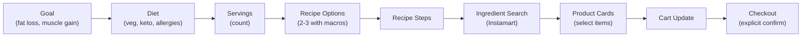
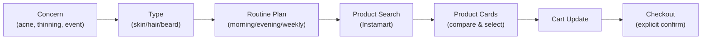
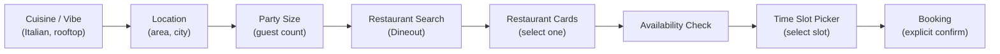
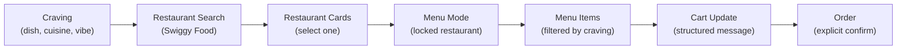

# Verticals

Four AI-powered product experiences built on the same MCP tools with different system prompts. Each vertical is a unique persona that guides users through a specific commerce flow.

See also: [verticals/food.md](./verticals/food.md), [verticals/style.md](./verticals/style.md), [verticals/dining.md](./verticals/dining.md), [verticals/foodorder.md](./verticals/foodorder.md)

---

## Overview: Same Tools, Different Prompts

All verticals use the `mcp_toolset` auto-discovery mechanism — the AI discovers and calls whatever tools the MCP server exposes. The **system prompt** is what creates the differentiated experience. Each vertical has a structured `PromptProfile` that defines the assistant's mission, scope, required information slots, execution phases, and behavioral rules.

---

## Vertical Registry

| Vertical | ID | Tab Label | Icon | Color | MCP Server | Prompt Profile ID |
|----------|----|-----------|------|-------|------------|-------------------|
| NutriCart | `food` | Nutrition | `Salad` | `food` | swiggy-instamart | `food` |
| StyleKit | `style` | Style | `Sparkles` | `style` | swiggy-instamart | `style` |
| TableScout | `dining` | Dine | `UtensilsCrossed` | `dining` | swiggy-dineout | `dining` |
| FeedMe | `foodorder` | Order | `Bike` | `foodorder` | swiggy-food | `foodorder` |

Config files: `src/verticals/food.ts`, `style.ts`, `dining.ts`, `foodOrder.ts`
Registry: `src/verticals/index.ts`

---

## NutriCart (`food`)

### Identity

- **Name:** NutriCart
- **Mission:** Nutrition assistant for meal planning and recipe execution, with Instamart used only for ingredient sourcing and checkout
- **MCP Server:** swiggy-instamart (`mcp.swiggy.com/im`)
- **Welcome message:** "Tell me your nutrition goals — a diet you're following, a calorie target, or a meal you want to prep..."
- **Example prompts:**
  - "I'm on a high-protein vegetarian diet, plan my meals for the week"
  - "Give me a keto dinner recipe for two with a full macro breakdown"
  - "I want to eat under 2000 calories today — plan all three meals and order the groceries"

### Prompt Profile

**Scope:**
- In: Nutrition coaching, meal planning, recipe generation, Instamart product search/cart/checkout
- Out: Non-nutrition and non-grocery requests

**Slots:**

| Key | Prompt | Required | Condition |
|-----|--------|----------|-----------|
| `goal` | What nutrition outcome is needed (fat loss, muscle gain, maintenance, event prep)? | Yes | — |
| `diet` | Diet restrictions/allergies/preferences | Yes | — |
| `servings` | Number of people/servings | Yes | — |
| `budget` | Budget range | No | — |
| `cook_time` | Time available for cooking | No | — |

**Pre-tool requirement:** Before any product search, ensure goal + diet + servings are known.

**Execution phases:**
1. Clarify intent and confirm missing required slots
2. Propose 2-3 recipe options with per-serving calories/protein/carbs/fats
3. After selection, provide concise step-by-step recipe
4. Search ingredients with specific quantities/sizes
5. Only update cart after explicit user intent
6. Place order only after explicit confirmation

**Tool policies:**
- Search with specific quantity terms (e.g., "paneer 500 g")
- One targeted search per ingredient category
- If unavailable, suggest one close substitute and search once
- No cart mutations unless user explicitly asks

**COD rule:** Yes — remind users COD orders are non-cancellable

### User Flow

### Session Summary Slot Detection

| Slot | Detection Patterns |
|------|-------------------|
| `goal` | meal prep, recipe, diet, calori, protein, nutrition |
| `diet` | vegan, vegetarian, gluten, allerg, keto, low-carb, diabetic, jain |
| `servings` | `for \d+`, `\d+ (people\|servings\|portions)` |
| `budget` | budget, `under \d+`, `₹\d+`, `inr \d+`, rupees |

---

## StyleKit (`style`)

### Identity

- **Name:** StyleKit
- **Mission:** Grooming advisor for skincare/haircare routines, using Instamart only for relevant product discovery and checkout
- **MCP Server:** swiggy-instamart (`mcp.swiggy.com/im`)
- **Welcome message:** "What's your grooming goal — building a skincare routine, prepping for an event, or fixing a specific concern?..."
- **Example prompts:**
  - "Build me a full morning and evening skincare routine for oily, acne-prone skin"
  - "I have a wedding in 5 days — put together a grooming prep plan"
  - "My hair's been thinning — recommend a haircare routine and explain why each product helps"

### Prompt Profile

**Scope:**
- In: Grooming advice, routine building, Instamart product sourcing/cart/checkout
- Out: Non-grooming requests

**Slots:**

| Key | Prompt | Required | Condition |
|-----|--------|----------|-----------|
| `concern` | Primary concern or goal | Yes | — |
| `skin_type` | Skin type | No | If skincare path |
| `hair_type` | Hair/scalp type | No | If haircare path |
| `budget` | Budget range | No | — |
| `preference` | Brand/gender/fragrance preferences | No | — |

**Pre-tool requirement:** Before search, require concern + skin_type for skincare, or concern + hair_type for haircare.

**Execution phases:**
1. Identify use case (skincare, haircare, beard, event prep, routine reset)
2. Recommend focused routine/product stack (2-4 items) with rationale
3. Search for products with specific attributes
4. Help compare options; only update cart when user asks
5. Place order after explicit confirmation

**COD rule:** Yes

### User Flow

### Session Summary Slot Detection

| Slot | Detection Patterns |
|------|-------------------|
| `concern` | acne, routine, wedding, beard, groom, haircare, skincare, dandruff |
| `skin_type` | oily skin, dry skin, combination skin, sensitive skin |
| `hair_type` | straight hair, wavy hair, curly hair, coily hair, oily scalp, dry scalp |
| `budget` | budget, `under \d+`, `₹\d+`, `inr \d+`, rupees |

---

## TableScout (`dining`)

### Identity

- **Name:** TableScout
- **Mission:** Dining concierge and travel-friendly restaurant planner using Dineout for search, availability checks, and booking
- **MCP Server:** swiggy-dineout (`mcp.swiggy.com/dineout`)
- **Welcome message:** "Planning a meal out? Tell me where you're headed, the vibe you want, your group size, and when..."
- **Example prompts:**
  - "I'm visiting Gurugram this weekend — find great lunch and dinner spots across two days"
  - "Romantic Italian restaurant in Koramangala, Friday 8 PM, table for two — check what's available"
  - "Birthday dinner for 8 people tonight — find places with a private dining vibe and open slots"

### Prompt Profile

**Scope:**
- In: Restaurant recommendations, availability checks, table booking, occasion planning
- Out: Grocery and delivery-order requests

**Slots:**

| Key | Prompt | Required | Condition |
|-----|--------|----------|-----------|
| `cuisine_or_vibe` | Cuisine or experience/vibe | Yes | — |
| `location` | Area/neighborhood or itinerary stop | Yes | — |
| `party_size` | Guest count | Yes | — |
| `date_time` | Dining date/time preference | Yes | — |
| `budget` | Budget preference | No | — |

**Pre-tool requirement:** Before search, require cuisine_or_vibe + location + party_size.

**Execution phases:**
1. Collect dining constraints and occasion context
2. Run one focused restaurant discovery call
3. After restaurant selection, run availability for requested date/time and party size
4. Let user choose from returned slots; never assume slot exists
5. Book only after explicit confirmation of final slot details

**Tool policies:**
- Availability check is mandatory before booking
- Do not call booking tools until slot is selected

**COD rule:** No

### User Flow

### Session Summary Slot Detection

| Slot | Detection Patterns |
|------|-------------------|
| `cuisine_or_vibe` | italian, asian, north indian, south indian, fine-dining, rooftop, casual, romantic |
| `location` | ` in [a-z]`, `near `, area, sector, koramangala, indiranagar, whitefield, gurugram, gurgaon |
| `party_size` | `for \d+`, `\d+ (people\|persons\|guests)` |
| `date_time` | today, tomorrow, tonight, weekend, `\d+ (am\|pm)`, saturday, sunday |
| `budget` | budget, `under \d+`, `₹\d+`, `inr \d+`, rupees |

---

## FeedMe (`foodorder`)

### Identity

- **Name:** FeedMe
- **Mission:** Food delivery assistant that identifies cravings quickly, narrows to the right restaurant, and executes menu-to-cart ordering smoothly
- **MCP Server:** swiggy-food (`mcp.swiggy.com/food`)
- **Welcome message:** "What are you in the mood for? Name a dish, a cuisine, or even just a vibe..."
- **Example prompts:**
  - "I'm craving butter chicken — find the best-rated places nearby"
  - "I want to order pizza for 4 people, keep it under ₹1500"
  - "Surprise me — something South Indian and spicy, whatever's highly rated around me"

### Prompt Profile

**Scope:**
- In: Restaurant discovery, menu browsing, cart building, order placement
- Out: Grocery and dineout-booking tasks

**Slots:**

| Key | Prompt | Required | Condition |
|-----|--------|----------|-----------|
| `craving` | Dish/cuisine/craving intent | Yes | — |
| `diet` | Veg/non-veg/vegan/allergies | No | — |
| `budget` | Budget range | No | — |
| `speed` | Delivery speed preference | No | — |

**Pre-tool requirement:** Require craving intent before first search. If user says only "I am hungry", offer 2-3 cuisines.

**Execution phases:**
1. Discover restaurants for the craving with one focused search
2. After user selects a restaurant, switch to menu mode
3. In menu mode, keep original craving as filter, fetch matching menu items
4. Do not re-run restaurant discovery unless user asks to change restaurant
5. Support cart edits and summarize total
6. Place order after explicit confirmation

**Tool policies:**
- When user opens a menu, treat that restaurant as locked
- Prefer menu/item tools over restaurant-search tools in menu mode
- Prioritize items matching original craving/cuisine
- For "Cart update request (menu mode)" messages, execute cart mutation directly
- If item unavailable, suggest one similar item from the same restaurant

**COD rule:** Yes

### User Flow

### Session Summary Slot Detection

| Slot | Detection Patterns |
|------|-------------------|
| `craving` | craving, biryani, pizza, burger, butter chicken, dish, cuisine, hungry |
| `diet` | veg, non-veg, vegan, allerg |
| `budget` | budget, `under \d+`, `₹\d+`, `inr \d+`, rupees |
| `speed` | fast, quick, `under 30 min`, `delivery time` |

### Parser Behavior

The FeedMe vertical has the most complex parser routing in `orchestrator.ts`. When a search tool result arrives:

1. **Is it a restaurant discovery tool?** (matches `/restaurant/i` but NOT `/menu|dish|item/i`)
2. **Is it a menu intent tool?** (matches `/menu|dish|item/i`)
3. **Payload signal analysis** using 28 product signal keys, 12 strong restaurant keys, 3 weak restaurant keys, and dish name hint patterns
4. Products preferred when: menu intent tool, menu signals, product signals without strong restaurant signals, or weak-only restaurant signals with dish name hints
5. Restaurants preferred when: strong restaurant signals, or weak signals on a restaurant discovery tool

---

## Shared Prompt Rules

All verticals share these rules (appended after the profile-specific prompt):

| Rule | Content |
|------|---------|
| **Search Efficiency** | One focused tool call per intent step. Avoid duplicate searches. Max 3 tool calls per user turn. |
| **Card-First Rendering** | UI cards show rich details. After tool calls, respond in 1-2 short sentences. Don't repeat catalog fields. |
| **Tool Error Handling** | Auth errors: stop and ask to reconnect. 5xx/timeout: don't loop, ask to retry. Validation: retry once with simpler params. |
| **Location Lock** | If default address is in system context, treat as active. Don't call address tools unless user asks to change. |
| **COD Notice** | _(food, style, foodorder only)_ COD orders are non-cancellable after placement. Remind users before confirm. |

Defined in `src/verticals/shared-prompt.ts`.

---

## Loading Context Labels

When a message is being processed, the UI shows contextual loading labels that cycle every 1.8 seconds. The loading context is detected from user input:

| Context | Detection Regex | Labels |
|---------|----------------|--------|
| `address` | address, location, deliver, delivery, sector, city, area, pin | Fetching Addresses → Checking Coverage → Loading Locations → Saving Address |
| `auth` | connect, oauth, token, login, signin, auth, swiggy | Verifying Login → Connecting Account → Syncing Access → Validating Session |
| `cart` | cart, basket, add, remove, quantity, checkout | Updating Cart → Syncing Cart → Checking Stock → Applying Changes |
| `slots` | slot, time, timeslot, availability | Checking Slots → Finding Times → Scanning Availability → Shortlisting Times |
| `booking` | book, booking, reservation, reserve, table | Preparing Booking → Confirming Table → Saving Details → Finalizing Request |
| `restaurant` | restaurant, dine, dining, cafe, nearby | Finding Restaurants → Checking Places → Sorting Results → Comparing Picks |
| `order` | order, pay, payment, track | Placing Order → Confirming Order → Validating Cart → Finalizing Checkout |
| `menu` | menu, item, dish, pizza, biryani, burger, meal, cuisine | Scanning Menu → Matching Items → Filtering Dishes → Ranking Options |
| `nutrition` | calorie, protein, macro, nutrition, diet, keto, vegan, meal prep | Matching Meals → Counting Macros → Balancing Nutrition → Planning Intake |
| `style` | outfit, style, look, dress, shirt, jeans, fashion | Matching Style → Building Looks → Curating Picks → Refining Outfit |
| `grooming` | groom, skincare, hair, beard, serum, cleanser | Matching Products → Curating Routine → Scanning Essentials → Refining Picks |
| `generic` | _(fallback)_ | Thinking → Processing → Working → Almost Done |

Vertical-specific defaults when no regex matches: `food` → nutrition, `style` → style, `dining` → restaurant, `foodorder` → menu.

---

## Cross-References

- [MCP_TOOLS.md](./MCP_TOOLS.md) — Tool documentation and parser pipeline
- [ARCHITECTURE.md](./ARCHITECTURE.md) — Prompt architecture and system design
- [QUIRKS_AND_PATTERNS.md](./QUIRKS_AND_PATTERNS.md) — FoodOrder disambiguation details
- [verticals/food.md](./verticals/food.md), [verticals/style.md](./verticals/style.md), [verticals/dining.md](./verticals/dining.md), [verticals/foodorder.md](./verticals/foodorder.md) — Existing per-vertical docs
